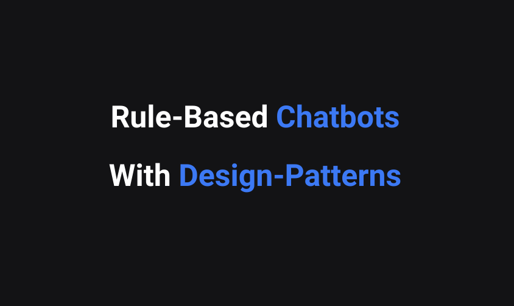
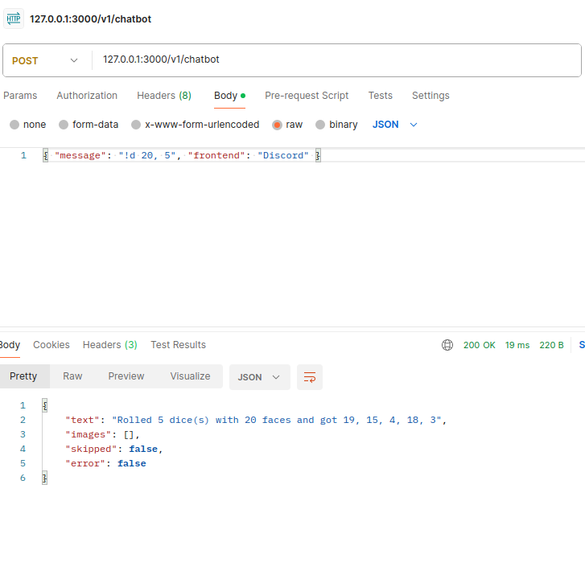

# Peer Chatbot Sample

## Presentation

https://docs.google.com/presentation/d/160-r3ZxWaU31VeZzjQ5eZ43fB8b-DMjMBP2HKah8kBU/edit?usp=sharing

## Installing and Running

### Simple run

1. Install [bun](https://bun.sh/).
2. Run the `backend`
3. Use Postman to interact with the backend.

### Complete run

For using the Discord client:
1. Install [bun](https://bun.sh/)
2. [Create a Discord App](https://discord.com/developers/docs/quick-start/getting-started)
3. Get your credentials into `frontends/discord/credentials.json`
4. Run the `frontend/discord` and the `backend`
